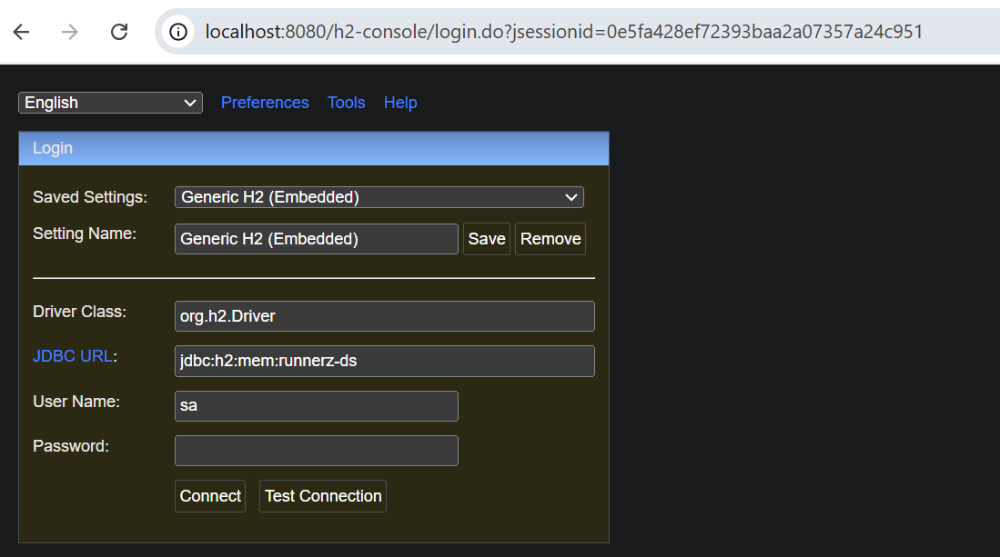
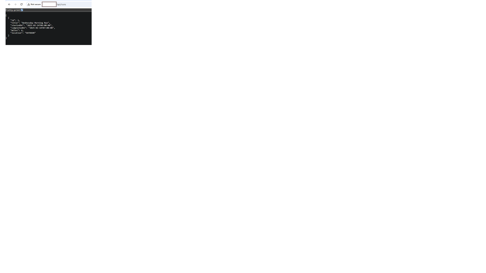

Reference: 
1. https://www.youtube.com/watch?v=31KTdfRH6nY&t=2711s&ab_channel=freeCodeCamp.org
2. https://shrihariharidas73.medium.com/deploying-a-simple-web-application-to-aws-ecs-with-github-actions-and-terraform-dd57200baa50

H2 Console is available at: http://localhost:8080/h2-console

user: sa 
password: no needed

Command to build image:
1. aws ecr get-login-password --region ap-south-1 | docker login --username AWS --password-stdin 033197833736.dkr.ecr.ap-south-1.amazonaws.com
2. docker build -t runnerz-app .
3. docker tag runnerz-app:latest 033197833736.dkr.ecr.ap-south-1.amazonaws.com/runnerz-app:latest
4. docker push 033197833736.dkr.ecr.ap-south-1.amazonaws.com/runnerz-app:latest

Commands to create AWS infrastructure using terraform:
1. terraform init
2. terraform plan
3. terraform apply

Command to destroy AWS infrastructure:
1. Delete container image from ECR manually
2. terraform destroy

